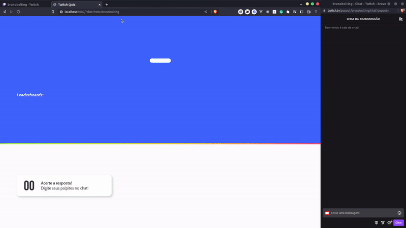

# Twitch Quiz

O Quiz consiste em mostrar perguntas na tela onde são respondidas através de um chat em algum canal da Twitch. Um bom caso de uso seria realizar stream dessa aplicação com o pessoal do chat tentando responder as perguntas. A aplicação possui leaderboard por sessão, onde cada vez que a página é recarregada ele inicia uma nova sessão.

Ela pega as perguntas de forma aleatória em cada sessão, de uma forma que ela só repete a pergunta quando todas as outras já foram passadas.

O projeto foi feito utilizando Go, onde a maior parte das funcionalidades é feita com go routines.

Foi um ótimo aprendizado realizar esse projeto, consegui entender e aplicar muitos conceitos de go routines e channels, algo que eu ainda não tinha me aprofundado e sempre tive dificuldade em entender.

Também consegui produzir um parser para o chat da Twitch seguindo a documentação deles e usando um usuário anônimo.

A aplicação ao meu ver é bem complexa, pois envolve várias go routines, um servidor web socket e também um cliente web socket, o código em si creio que possa ser bastante melhorado, não sei se da forma que fiz seria a melhor considerando custo de processamento.

No geral foi um projeto muito divertido de fazer, houveram várias dificuldades ao longo do desenvolvimento, dando destaque para a criação de multiplos jogos podendo acontecer ao mesmo tempo e também garantir o encerramento de todas as go routines quando um cliente se desconecta do servidor web socket.

Exemplo de como a aplicação funciona:


Para subir a aplicação basta seguir os comandos abaixo:

```
docker-compose build
```
```
docker-compose up -V
```

Pra acessar a aplicação basta acessar o localhost abaixo, colocando no `chat-from` o username da twitch que será usada como chat input.
```
http://localhost:8080/?chat-from=brunobolting
```
* Exemplo:
    * Minha twitch é `twitch.com/brunobolting`
    * Então vou colocar na url `?chat-from=brunobolting`

Cada vez que o código for alterado é necessário rodar o `docker-compose build` novamente, para o código novo ser recompilado dentro do container docker.

Uma nova funcionalidade que pode ser implementada é a criação de uma tela para cadastro de perguntas, hoje é utilizado um arquivo json que fica dentro da pasta `fixture`, que sempre que o container sobe é adicionado no mongodb. Um formulário para inserção das perguntas ajudaria pessoas menos técnicas a utilizar a aplicação também.

Qualquer dica ou crítica para melhorar o projeto e o código são bem-vindas =)
